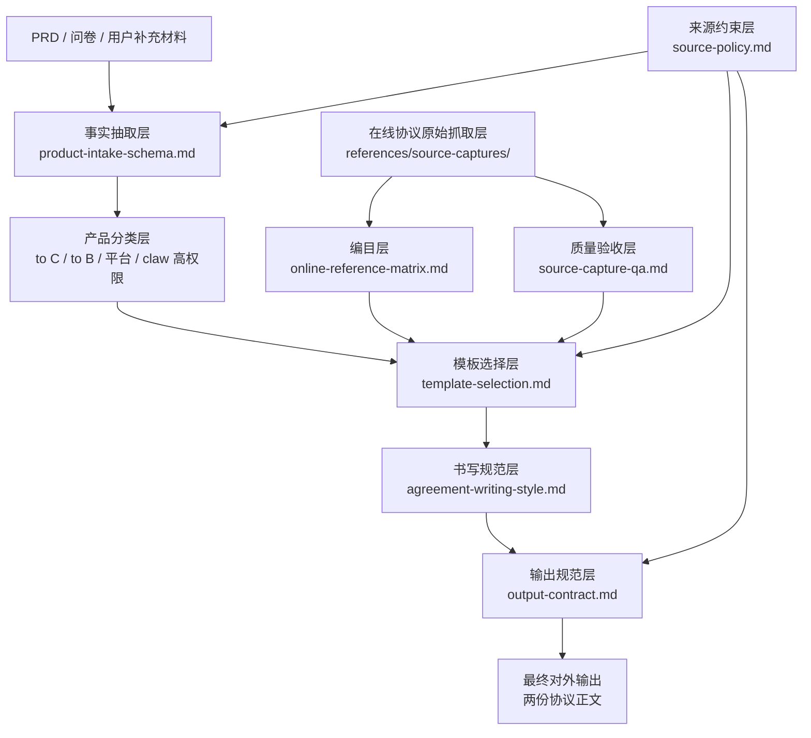

# PRD Legal Drafter

从产品 PRD、问卷补充信息和已批准的协议库中，起草两份对外协议：

- `用户协议` / `服务协议` / `软件许可及服务协议`
- `隐私政策` / `隐私权政策`

核心原则只有一条：**基于事实起草，不编造事实。**

## 这套 Skill 在做什么

这不是一个“直接拿大模型凭印象写协议”的方案，而是一套分层的知识库驱动流程：

1. 先从 PRD 提取事实。
2. 再判断产品属于哪种 archetype。
3. 再去匹配最接近的协议基线。
4. 再用真实在线协议中沉淀出来的结构和书写规范去起草。
5. 对 PRD 没写清的内容，保留 `[待确认：...]`，而不是擅自补齐。

## 知识库嵌入架构

## 为什么主设计文件改动不大，但知识库其实很多

因为这套设计采用的是“主控文件 + 分层知识库”的方式，而不是把几十份协议正文硬塞进一个文件。

### 1. 原始材料层

路径：[references/source-captures/](references/source-captures/)

这里存放实际抓下来的在线协议和产品页 markdown，例如：

- [references/source-captures/qianwen-chat/qianwen-user-agreement.md](references/source-captures/qianwen-chat/qianwen-user-agreement.md)
- [references/source-captures/tongyi-wanxiang/wanxiang-privacy-policy.md](references/source-captures/tongyi-wanxiang/wanxiang-privacy-policy.md)
- [references/source-captures/agentone/agentone-service-agreement.md](references/source-captures/agentone/agentone-service-agreement.md)
- [references/source-captures/wukong/wukong-service-agreement.md](references/source-captures/wukong/wukong-service-agreement.md)

这些文件就是最底层的“正文知识库”。

### 2. 编目层

路径：[references/online-reference-matrix.md](references/online-reference-matrix.md)

这一层把零散的在线协议整理成可检索的 archetype，例如：

- `provider_to_c_mobile_login_ai_assistant`
- `provider_to_c_mobile_login_ai_media`
- `provider_to_c_site_builder_with_workspace`
- `supporter_console_platform`
- `supporter_enterprise_agent_platform`
- `work_ai_claw_high_privilege`

Skill 不需要先读完所有原始协议再猜，而是先从这里找到“最可能的一组参考源”。

### 3. 质量闸门层

路径：[references/source-capture-qa.md](references/source-capture-qa.md)

不是所有抓下来的文件都能直接用。这里把抓取结果分成：

- `A usable`
- `B usable with caveats`
- `C weak`

例如：

- 千问、万相、百炼、AgentOne、悟空的协议正文，大多可直接用于结构参考
- 多数产品首页只适合做“定位信号”
- 听悟的用户协议抓取过短，只能辅助判断“它更像继承生态协议层”，不能直接借来写用户协议

### 4. 写作规范层

路径：[references/agreement-writing-style.md](references/agreement-writing-style.md)

这一层不是存正文，而是把多个真实协议里稳定可复用的写法抽象出来，例如：

- 什么产品更适合叫 `服务协议`
- 什么产品更适合叫 `软件许可及服务协议`
- 隐私文件什么时候用 `隐私政策`，什么时候用 `隐私权政策`
- consumer AI、enterprise platform、claw 高权限产品分别该怎么组织开头和章节
- 最终对外文本不能出现 benchmark、模板来源、溯源说明

### 5. 主流程控制层

路径：

- [SKILL.md](SKILL.md)
- [references/template-selection.md](references/template-selection.md)
- [references/output-contract.md](references/output-contract.md)
- [references/source-policy.md](references/source-policy.md)

这一层负责把前面几层真正串起来，形成一条稳定工作流。

## 实际调用路径

一次生成任务的大致执行顺序如下：

1. 读取 PRD 和补充材料。
2. 用 [references/product-intake-schema.md](references/product-intake-schema.md) 抽取事实。
3. 用 [references/template-selection.md](references/template-selection.md) 和 [references/online-reference-matrix.md](references/online-reference-matrix.md) 选择 archetype。
4. 用 [references/source-capture-qa.md](references/source-capture-qa.md) 判断对应参考源能不能信。
5. 需要时回看 [references/source-captures/](references/source-captures/) 里的真实协议正文。
6. 用 [references/agreement-writing-style.md](references/agreement-writing-style.md) 决定标题、开头块、章节命名、专业表达方式。
7. 按 [references/output-contract.md](references/output-contract.md) 输出最终两份协议。

## 目前已经沉淀进去的在线协议知识库

已抓取并纳入规划的分组包括：

- `qianwen-chat`
- `tingwu`
- `tongyi-wanxiang`
- `xiaozhi`
- `jvsclaw`
- `bailian`
- `agentone`
- `wukong`
- `arkclaw`

对应目录见：[references/source-captures/](references/source-captures/)

## 外部输出与内部工作底稿的边界

默认对外交付只输出两份协议，不输出：

- `事实来源`
- `模板选择说明`
- `条款来源`
- `溯源摘要`
- `参考某某协议`

相关规则见：[references/output-contract.md](references/output-contract.md)

## 关键文件索引

- Skill 主入口：[SKILL.md](SKILL.md)
- 产品事实抽取：[references/product-intake-schema.md](references/product-intake-schema.md)
- 模板选择：[references/template-selection.md](references/template-selection.md)
- 在线参考源矩阵：[references/online-reference-matrix.md](references/online-reference-matrix.md)
- 抓取质量验收：[references/source-capture-qa.md](references/source-capture-qa.md)
- 协议书写规范：[references/agreement-writing-style.md](references/agreement-writing-style.md)
- 输出规范：[references/output-contract.md](references/output-contract.md)
- 来源约束规则：[references/source-policy.md](references/source-policy.md)

## 示例

- 示例 PRD：[examples/sample-prd-lingxi-notes.md](examples/sample-prd-lingxi-notes.md)
- archetype 选择示例：[examples/archetype-selection-examples.md](examples/archetype-selection-examples.md)
